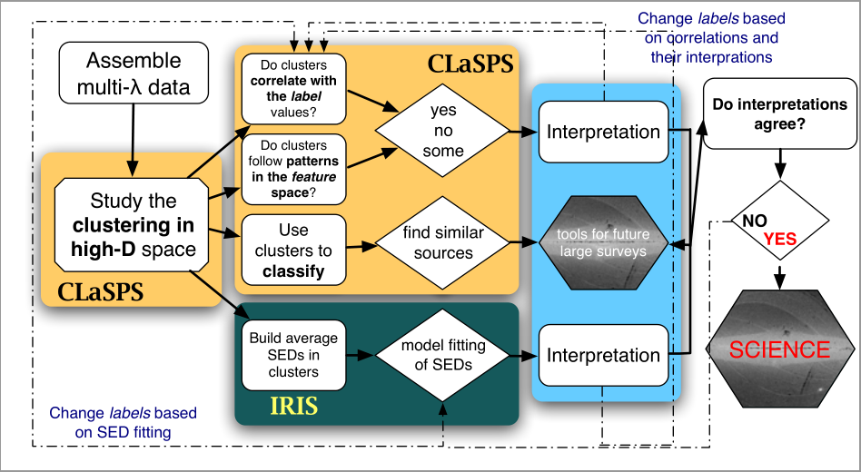

% Iris 2.1 beta
% Omar Laurino; Jamie Budynkiewicz
% June 17, 2015

# Released Iris v2.1 beta in May
- transitioned from VAO to SAO support last October
- plan to transition from beta in Sept to give time 
for feedback from the community
- New developer started this week that will work on 
Iris upgrades

# What is new in 2.1
- It is now possible to integrate under fitted model components
- Template models can now be combined with regular models
- SEDs can be statistically combined
- Iris has been repackaged

#
<iframe src="https://drive.google.com/a/cfa.harvard.edu/file/d/0BwbX0VxOVx-idW5QeEV5S29VZE0/preview" width="800" height="600"></iframe>

# Packaging
- Iris is now available through the [conda]("http://conda.pydata.org/docs/") package manager
- Java GUI &#8644; SAMP &#8644; Python backends:
    - [Sherpa](https://github.com/sherpa/sherpa) for modeling
    - [SedStacker](https://github.com/jdubynk/sedstacker)
- Sherpa and SedStacker are available on GitHub as standalone packages

# Future: Short List
- More resources available through ASDC plug-in
- Support Spectral DM 2.0
- Document standalone Python API

# Future: Long Term
- Replace the visualizer:
    - Specview4Iris cannot be maintained
    - Support high resolution spectra
- Support Cube DM

# A KDD science case
Courtesy of Raffaele D'Abrusco <!-- ' -->

