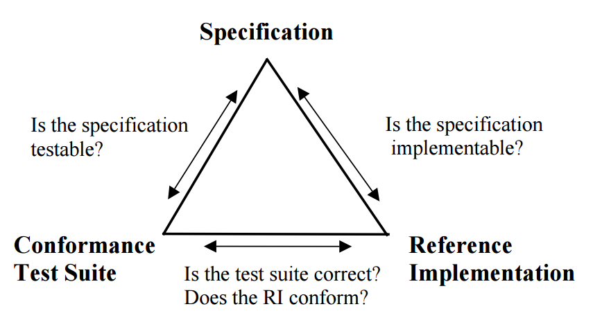

% Reference Implementation of Data Models
% Omar Laurino
% June 13, 2015

# Why this presentation

## Reference Implementation of a Data Model specification
SpectrumDM 1.1 discussion page (no info on 1.03 and 1.1 RFC):

>SSA is considered as the main reference implementation for Spectrum DM . It is widely implemented in the VO (check with VO registry)

. . .

ObsCore RFC Page:

> CDAC OBsTAP service  
XMM SSC ObsTAP service   
GAVO ObsCore table

## Spectral 2.0
TCG review period ended on Sep 15, 2014.

>Are there **two interoperating reference implementations** of SpectralDM? **How does one demonstrate/explain that a reference implementation is complete?** Until we can answer these questions, it will not be possible to ask the Exec for endorsement as a recommendation. (*Oct 11, 2014*)

## Spectral 2.0
TCG review period ended on Sep 15, 2014.

>as the model is so large, I`d like to get an idea **what part of the standard these actually use/support,
and in what sense interoperability has been shown**.
I am a bit surprised that TSAP is a reference implementation,
when 7.1.2 requires a 'SpatialAxis'.
On the mailing list, the rationale for this was
that the model was meant for observational spectra.
As a baseline, I think there should be **at least example
serialisations using all features**
provided by the DM. (*Sep 16, 2014*)

## Spectral 2.0
Fair comments, however:

- Was the timing appropriate? Is the process properly spec'ed out? <!-- ' -->
- What **exactly** are the requirements for reference implementations of Data Models?

# A step back\
Reference Implementations 

## An operational definition
A reference implementation

- Verifies that the specification is implementable
- Helps to clarify the intent of the specification in situations where **conformance tests** are inadequate
- Is developed concurrently with the specification **and test suite**
- Serves as Gold Standard against which other implementations can be measured

From: [Curran, Patrick (2003). Conformance Testing: An Industry Perspective. Sun Microsystems.](https://web.archive.org/web/20120303000051/http://vote.nist.gov/speeches/1%20-%20Specification%20Panel/6%20-%20Curran.pdf) 

## Conformance Testing

## Highlights
- Specifications must be testable
<!--    - testable assertions are derived from normative statements
    - unspecified, ambiguous, implementation-specific statements cannot be tested -->
- Optional behavior is discouraged
    - Can be tested, but weakens uniformity and interoperability
- All implementations must pass the same test suite
- Conformance Requirements documents specify... the requirements for conformance

## A W3C example
>[WG must show] that **each feature of the technical report has been implemented**.
**Preferably**, the Working Group should be able to demonstrate
**two interoperable implementations of each feature**.

>If the Director believes that immediate Advisory Committee review is critical
to the success of a technical report, the Director **may accept** to
Call for Review of a Proposed Recommendation
even **without adequate implementation experience**;

## A W3C example
<iframe height="550px" width="800px" src="http://www.w3.org/TR/1998/REC-CSS2-19980512/conform.html"></iframe> 

# A step back\
Data Models in IVOA

## The DM Working Group...
>[...] provide[s] a **framework
for the description of metadata** attached to observed or simulated data.

. . .

>[...] focuses
on **logical relationships between these metadata**,
examines how an astronomer wants to retrieve, process and interpret astronomical data,
and **provides an architecture** to handle them.

. . .

>[...] What is defined in this WG can then be **re-used**
in the protocols defined **by the DAL WG or in VO aware applications**.

## IVOA Document Standards
>Working Group reviews the Working Draft. Two reference implementations of any
associated **software** are expected, as well as provision of **validation tools**.

. . .

>- the term *reference implementation* is not defined
- validators mandated
- one definition for all the standards 
- no univocal interpretation for DMs

## What is a Data Model implementation?
- Server side:
    - relational database
    - DAL service implementation
- Client side:
    - DAL client
    - domain specific application
- Client &#x2229; Server:
    - instance serialization(s) [no software]
    - XML schema [unused]
    - validators

## Difficulties
- Implementations are open-ended
    - local vs standard DM 
    - should a reference serialization implement **ALL** possible permutations?
- Human readable documents make validators...:
    - hard to develop
    - ad hoc, hardly reusable
- Stakeholders:
    - are implementors, not necessarily modelers (in the IVOA sense)

. . .

Can we create **some sort of** Conformance Test?

# A proposal

## L`esprit des lois
[The spirit of the laws]

- DMs do not grow in a vacuum:
    - Use Cases come from CSP, DAL, and Applications
    - Existing services/apps may already implement custom models
    - If somebody is modeling, somebody (else) must have interest in implementations

The standard recommendation process requires reference implementations
to ensure interoperability and usability.

## What are we missing?
- Standardized Data Model descriptions and serialization strategies
- Conformance Requirements:
    - how to run the conformance tests
    - what it means to pass
    - untestable criteria to meet
- Apps and DAL involvement in the reference implementation process?

An unambiguous, sustainable, development lifecycle.

## Conformance Testing

## How VODML helps
>- Implements the DM WG charter:
    - framework for the description of metadata
    - focuses on logical relationships
    - provides an architecture to handle metadata
    - takes into account Apps and DAL needs

. . .

>- Enables model-agnostic tools for sustainable development of standards:
    - VO Mapper
    - One validator to rule them all
    - VO Modeler
    - I/O libraries may come for free

## How VODML helps
- A significant step towards conformance requirements:
    - DM specifications **must** have a VODML description
        - **model** can be validated
        - model **instances** can be validated
        - **DAL responses** can be validated
        - implementation **coverage** can be measured

# Summary

## Some questions to answer
- **What is a DM reference implementation?** Should we clarify the standard process description regarding reference implementations?
- **Who implements it?** Do we need coordination among working groups? A specification is a team effort with multiple stakeholders. Is the DM editor the best person to drive implementations?
- **What do we need?** VODML is a start, but should we refine the recommendation process?

