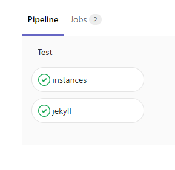
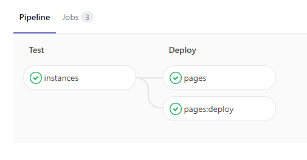
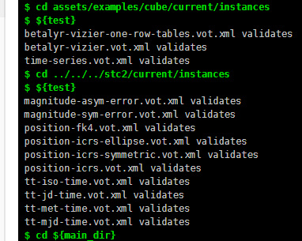
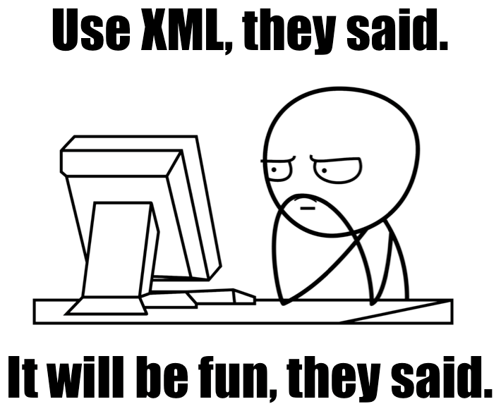

## Outline

>  - Modeling Implementations Website (OL)
  - Rama, an Astropy-Aware Python parser for VODML (OL)
  - Mapping Tool (GL)
  - Hubble Source Catalog implementation (TD)
  - Demo of interoperability between independend implementations - STScI/JHU/CfA (TD)
  - Simplifying the VODML Mapping Syntax (OL)
  - Collaborating and Testing: Git and Continuous Integration (OL) 

## [Implementations Website](https://olaurino.gitlab.io/ivoa-dm-examples)

## Modeling Workflow


## Writing Models

By hand/XML editor

with a UML tool + translation scripts

with a Domain Specific Language

<!--
## Writing Models

  * XML is *ambivert*
    * more machine-readible than human-writable
  * DSLs are also *ambivert*
    * more human-writable than machine-readable
  * DSLs are custom languages
    * but Internal DSLs mitigate issue
  * UML tools a compromise?
    * but interoperability is minimal
-->

## Writing Models (JAVA/Groovy DSL)
[Jovial](https://github.com/olaurino/jovial)

```ruby
model("source") {
    include("ivoa", version: "1.0")
    dataType("Position") {
        attribute(name: "ra", dataType: "ivoa:real")
        attribute(name: "dec", dataType: "ivoa:real")
    }
    objectType("Source") {
        attribute(name: "name", dataType: "ivoa:real")
        attribute(name: "position", dataType: "source:Position")
    }
}
```

## How to write Instances

> - Error prone: we are overloading the xml semantics to describe non-xml data models
> - XML validation against VOTable schema, not model semantics
> - We don't have a validator yet

## How to write Instances

~~By hand/XML editor~~

~~With a UML tool + translation scripts~~

With a Domain Specific Language

Gerard's Mapping Tool (point 'n click!)
  
## Jovial (JAVA/Groovy)
```ruby
def modelLocation = "file:example.vodml.xml"
def ivoaModelLocation = "https://volute.g-vo.org/svn/trunk/projects/dm/vo-dml/models/ivoa/vo-dml/IVOA-v1.0.vo-dml.xml"

dmInstance {
    model(vodmlURL: modelLocation)
    model(vodmlURL: ivoaModelLocation)
    instance(type: "source:Source") {
        instance(role: "name", value: "A Source")
        instance(role: "position") {
            instance(role: "ra", value: 122.02)
            instance(role: "dec", value: -12.44)
        }
    }
}
```

## Parsing Annotated VOTables

[Rama](https://github.com/olaurino/rama)

Parses almost all the single-table patterns

```python
@VO('source:Position')
class Position(BaseType):
    ra = Attribute('source:Position.ra', min_occurs=1, max_occurs=1)
    dec = Attribute('source:Position.dec', min_occurs=1, max_occurs=1)


@VO('source:Source')
class Source(BaseType):
    name = Attribute('source:Source.name', min_occurs=1, max_occurs=1)
    position = Attribute('source:Source.position', min_occurs=1, max_occurs=1)
```


## Addressing Duality

> - Row-based (Objects) vs Column-based (Tables) Views
> - Sources: one source per row, multiple per table.
> - Light Curves: one per table, data in columns.

## Tricky Use Cases

HSC catalog has columns referring to photometry filters.

ID | ... | Instrument | Filter
--- | --- | --- | ---
247770718 | ... | WFPC2 | F814W
255488227 | ...  | ACS | F606W

## Astropy integration
Astropy is used to parse `<TABLE>`

Data is represented as Astropy quantities/columns when possible

## Astropy integration
Adapters can be provided to decorate VODML objects

```python
from astropy.coordinates import SkyCoord
from rama.models.coordinates import EquatorialCoord

simple_position_file = read("file.vot.xml")
position = simple_position_file.find_instances(StdPosition)[0]

assert isinstance(position.coord, SkyCoord)
assert isinstance(position.coord.__vo_object__, EquatorialCoord)
```

## Gerard's Mapping Tool Demo

## Tom's HSC and Interoperability Demo

## Simplifying the Mapping Syntax

feedback:

  * too many elements
  * use attribute names only, not full identifies
  * leave annotation unchanged when `FIELD`s *become* `PARAM`s and vice-versa
  * remove `LITERAL` and only use `CONSTANT`/`COLUMN`?

## Simplifying the Mapping Syntax

You can only start by *mapping* VODML concepts (roles, types) to VOTable concepts (tables, columns, params)

## Simplifying the Mapping Syntax
[View it on Github](https://github.com/olaurino/rama/tree/simplified-syntax)

  * [ad5eb73 ATTRIBUTE -> ROLE](https://github.com/olaurino/rama/commit/ad5eb73cf2cd7311cd263a33f9b51891e79288ef)
  * [f010d19 remove CONSTANT for INSTANCE](https://github.com/olaurino/rama/commit/f010d19780970a24bcdf51c1919022f51e6f81a1)
  * [92ad210 support CONSTANT](https://github.com/olaurino/rama/commit/92ad2109a404ad78a49a42c5e8bfd524c103f739)
  * [61c6cf4 replace COLUMN with INSTANCE](https://github.com/olaurino/rama/commit/61c6cf41ade959b77254bc4e023bfdd1d35b1602)
  * [3615fcc replace LITERAL with INSTANCE](https://github.com/olaurino/rama/commit/3615fcc2840187039a97704d5083d02ea5b93781)
  * [a7a84bc use only role's name](https://github.com/olaurino/rama/commit/a7a84bc09466b700fbb841dba271ebd6557b98fd)
  * [00c41d8 remove COMPOSITION and REFERENCE](https://github.com/olaurino/rama/commit/00c41d83c2f9ab303d97c56708da18ef1e3c64c5)

## Before

```xml
<INSTANCE ID="_source" dmtype="source:Detection">
    <COMPOSITION dmrole="source:Source.position">
        <INSTANCE dmtype="source:SourcePosition">
            <ATTRIBUTE dmrole="meas:CoordMeasure.coord">
                <INSTANCE dmtype="coords:domain.space.EquatorialCoord">
                    <ATTRIBUTE dmrole="coords:domain.space.EquatorialCoord.ra">
                        <COLUMN ref="SourceRA" dmtype="ivoa:real"/>
                    </ATTRIBUTE>
                    <ATTRIBUTE dmrole="coords:domain.space.EquatorialCoord.dec">
                        <COLUMN ref="SourceDec" dmtype="ivoa:real"/>
                    </ATTRIBUTE>
                    <REFERENCE dmrole="coords:Coordinate.frame">
                        <IDREF>_icrs_</IDREF>
                    </REFERENCE>
                    <ATTRIBUTE dmrole="omar:Made.this.up">
                        <CONSTANT ref="_SOME_PARAM" dmtype="ïvoa:real"/>
                    </ATTRIBUTE>
                    <ATTRIBUTE dmrole="omar:Something.different">
                        <LITERAL value="42" dmtype="ïvoa:real"/>
                    </ATTRIBUTE>
                </INSTANCE>
            </ATTRIBUTE>
        </INSTANCE>
    </COMPOSITION>
</INSTANCE>
```

## After

```xml
<INSTANCE ID="_source" dmtype="source:Detection">
    <ROLE dmrole="position">
        <INSTANCE dmtype="source:SourcePosition">
            <ROLE dmrole="coord">
                <INSTANCE dmtype="coords:domain.space.EquatorialCoord">
                    <ROLE dmrole="ra">
                        <INSTANCE ref="SourceRA" dmtype="ivoa:real"/>
                    </ROLE>
                    <ROLE dmrole="dec">
                        <INSTANCE ref="SourceDec" dmtype="ivoa:real"/>
                    </ROLE>
                    <ROLE dmrole="frame">
                        <IDREF>_icrs_</IDREF>
                    </ROLE>
                    <ROLE dmrole="up">
                        <INSTANCE ref="_SOME_PARAM" dmtype="ïvoa:real"/>
                    </ROLE>
                    <ROLE dmrole="different">
                        <INSTANCE value="42" dmtype="ïvoa:real"/>
                    </ROLE>
                </INSTANCE>
            </ROLE>
        </INSTANCE>
    </ROLE>
</INSTANCE>
```

## Two different approaches

model driven

annotation driven/dynamic

## My recommendation

> - **Explicit syntax** is trivial-to-simple to implement for single table cases
> - **Maybe** replace `COMPOSITON`, `REFERENCE`, `ATTRIBUTE` with `ROLE`
> - Using attribute names imho **only** facilitates dynamic parsers
> - Merging `CONSTANT` and `COLUMN` is a mess (**compelling use case?**)

## Implementations repository

> - Volute simply doesn't cut it, for so many reasons.
> - Model changes require changes to many examples/notebooks
> - Git(Lab) repository with Continuous Integration:

> 1. static pages are built upon push ([jekyll](https://jekyllrb.com/))
> 2. tests are run
> 3. pages are deployed.
  
## Gitlab-CI Pipelines




## Tests




## Thank you!

{ width=50% }

[Understanding XML: The Human’s Guide to Machine-Readable Data](https://blog.safe.com/2016/07/understanding-xml-humans-guide-machine-readable-data/)